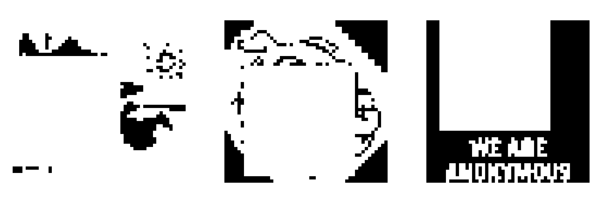
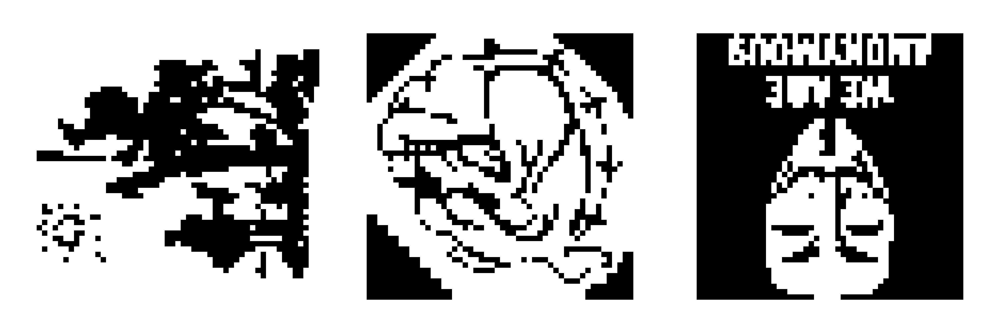
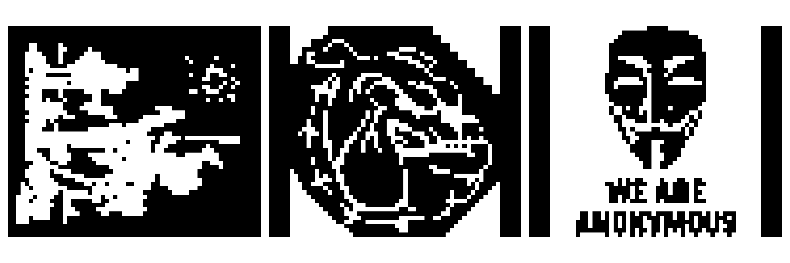
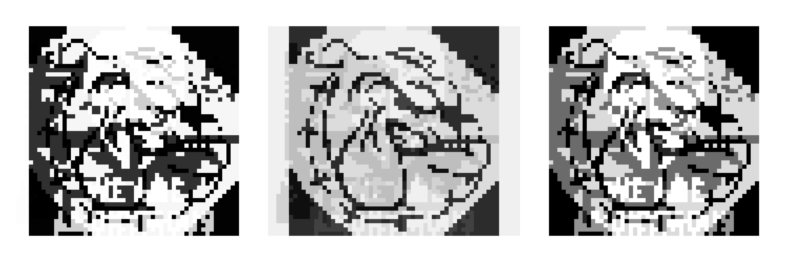
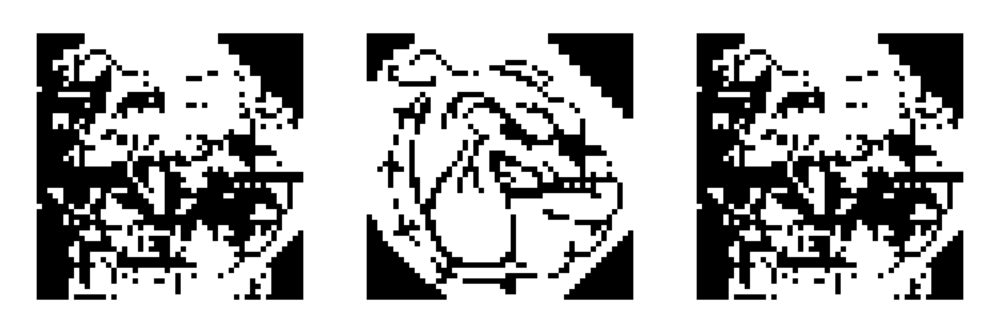
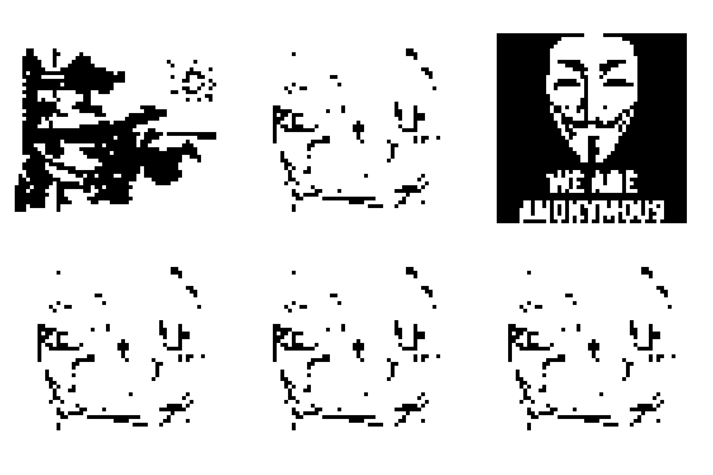

---
author:
- Alejo Ordoñez - 108397
date: Jueves 26 de Septiembre, 2024
title:
- Trabajo Práctico I Aprendizaje Profundo
- |
  Trabajo Práctico I\
  Aprendizaje Profundo
---

# Introducción

En este informe se presentan varios resultados obtenidos empíricamente a
partir del entrenamiento de una red de Hopfield.

# Red de Hopfield

Vamos a entrenar un modelo de Hopfield con un conjunto de 6 imágenes.
Primero vamos a elegir un subconjunto de las mismas para ver si puede
aprenderlas, luego vamos a corromper esas imágenes para ver si aún así
logra distinguirlas y por último vamos a intentar enseñárselas todas.

{#fig:figura1 width="50%"}

Una red de Hopfield es un modelo de memoria asociativa que usa la regla
de Hebb para todos los pares $ij$ posibles, con unidades binarias y
actualización asíncrona.

Regla de Hebb:
$w_{ij} = \frac{1}{N} \sum_{\mu=1}^{p} \xi_{i}^{\mu} \xi_{j}^{\mu}$.

Para entrenar la red, se uniformiza el tamaño de las imágenes. En este
caso decicí tomar como estándar las dimensiones de la imágen más grande
y colocar aquellas que estuvieran por debajo sobre un fondo blanco de
ese tamaño: 50 x 60.

La red de Hopfield, es en el notebook, una clase con métodos entrenar y
recuperar. El entrenamiento consiste en asignar a los pesos la suma del
producto de los patrones con sigo mismos, asegurando el 0 en la
diagonal, pues las unidades no deben hacer sinpasis consigo mismas en
este modelo.

## Verifación del aprendizaje

Para verificar si la red aprendió o no las imágenes enseñadas,
intentamos recuperarlas sin ninguna modificación. Se entrena primero el
modelo con tres de las imágenes de la figura
 [1](#fig:figura1){reference-type="ref" reference="fig:figura1"}. El
resultado era el esperado, la red converge en las imágenes originales.

{#fig:figura2 width="50%"}

{#fig:figura3 width="50%"}

## Evaluación de versiones alteradas de las imágenes

Para probar qué tan bien funciona la red, se distorsionan las imágenes
que se intentan recuperar, con el objetivo de obtener las imágenes
originales con las cuáles el modelo fue entrenado.

Primeramente se les agrega ruido a cada una de las imágenes. Esto se
hace invirtiendo $(\text{nivel}*\text{tamaño de la imagen})$ píxeles. En
este caso, se invirtieron la mitad de los píxeles. Al intentar recuperar
las imágenes, la red las recordó correctamente.

{#fig:figura4 width="50%"}

{#fig:figura5 width="50%"}

Nuevamente, corrompemos las imágenes, ésta vez eliminando cuadrados de
tamaño $(text{nivel} \times text{tamaño de la imagen})$ posicionados
aleatoriamente. Y otra vez la red las recupera correctamente.

{#fig:figura6
width="50%"}

{#fig:figura7 width="50%"}

Rotamos las imágenes $180^{\circ}$. Esta vez la red se equivoca, y
confunde la primera con la segunda.

{#fig:figura8
width="50%"}

{#fig:figura9 width="50%"}

## Existencia de estados epurios

Un estado epurio es un estado estable que la red aprendió sin que se le
enseñara. Para evaluar la existencia de estos estados, vamos a intentar
recuperar patrones inversos y combinaciones lineales de una cantidad
impar de imágenes del entrenamiento.

{#fig:figura10
width="50%"}

{#fig:figura11
width="50%"}

{#fig:figura12
width="50%"}

{#fig:figura13
width="50%"}

La red recupera estos estados estables, que no se le enseñaron. Y así se
verifica la existencia de estados epurios.

## Entrenamiento con todas las imágenes

Cuando entrenamos la red con las imágenes de la figura
 [1](#fig:figura1){reference-type="ref" reference="fig:figura1"},
obtenemos al verificar su aprendizaje, es decir al intentar recuperar
esas mismas imágenes, que la red no aprendió correctamente.

{#fig:figura14
width="50%"}

La red no puede aprender bien los 6 patrones. Esto se debe a un punto
débil de Hopfield: su capacidad de almacenamiento, que evidentemente, es
excedida en este caso con 6 patrones.

# Capcaidad de la red

## Capacidad máxima en función del tamaño y error aceptable

En función del tamaño $N$ de la red buscamos, empíricamente, cuál es su
máxima capacidad de almacenamiento $p_{\text{máx}}$ si toleramos cierta
probabilidad de error
$P_{\text{error}} = \frac{\#\text{patrones recuperados}}{\#\text{patrones totales}}$.
Para medir esto, simulamos un ciclo en el cual agregamos más patrones
pseudo-aleatorios a medida que la red los aprende, tomando como prueba
de que pudo con ellos, que $P_{\text{error}}$ sea menor a cierto número,
es decir, que el cociente entre la cantidad de patrones recuperados y
patrones totales sea menor a uno menos esa probabilidad tolerada
$1 - P_{\text{error}}$. Obtenemos entonces, para éste experimento, la
siguiente tabla:

::: {#tab:tabla1}
   $P_{\text{error}}$   $p_{\text{máx}} / N$
  -------------------- ----------------------
         0.001                  0.1
         0.0036                 0.13
          0.01                  0.12
          0.05                  0.2
          0.1                   0.3

  : $p_{\text{máx}} / N$ para valores de $P_{\text{error}}$
  determinados.
:::

## Capacidad de la red con patrones correlacionados

Ahora vamos a realizar el mismo experimento, sólo que esta vez, vamos a
ir haciendo que la red aprenda más y más patrones correlacionados. Para
eso partimos del patrón anterior y le agregamos ruido para crear uno
nuevo.

::: {#tab:tabla2}
   $P_{\text{error}}$   $p_{\text{máx}} / N$
  -------------------- ----------------------
         0.001                  0.02
         0.0036                 0.02
          0.01                  0.02
          0.05                  0.02
          0.1                   0.02

  : $p_{\text{máx}} / N$ para valores de $P_{\text{error}}$
  determinados, entrenando la red con patrones correlacionados entre sí.
:::

Evidentemente la red no puede generalizar si se le enseñan patrones
demasiado parecidos, no logra diferenciar entre mínimos locales
superpuestos en la función de energía.

::: thebibliography
9

John Hertz, Anders Krogh, Richard G. Palmer, *Introduction to the Theory
of Neural Computation*.
:::
